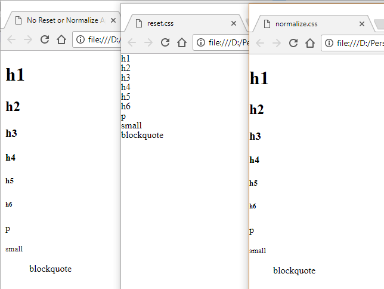

# Reset.css or Normalize.css
In the begining of the browser application there was no standardisation on styles so every browsers implemented their own styles. For example the default font used by IE and Firefox where different even these browsers provided a feature to set the default font and size incase if web page didn't have any styles applied. Similarly margins, paddings were different in browsers. So inorder to bring the consistency among the browsers style [reset.css](http://meyerweb.com/eric/tools/css/reset/reset.css) and [normalize.css](https://necolas.github.io/normalize.css/7.0.0/normalize.css) were introduced.

## So why two kinds of CSS's?
Reset.css aim to remove all built-in browser styling. So that elements like h1 - h6, p, strong, em end up looking exactly alike, having no decoration at all. You are then supposed to add all decoration yourself.

Normalize.css aims to make built-in browser styling consistent across browsers. Elements like h1 - h6 will appear largest to smallest in a consistent way across browsers. You are then supposed to add only the difference in decoration. I personally prefer Normalize.css. 

Let us see how web page appears after applying reset.css and normalize.css
 